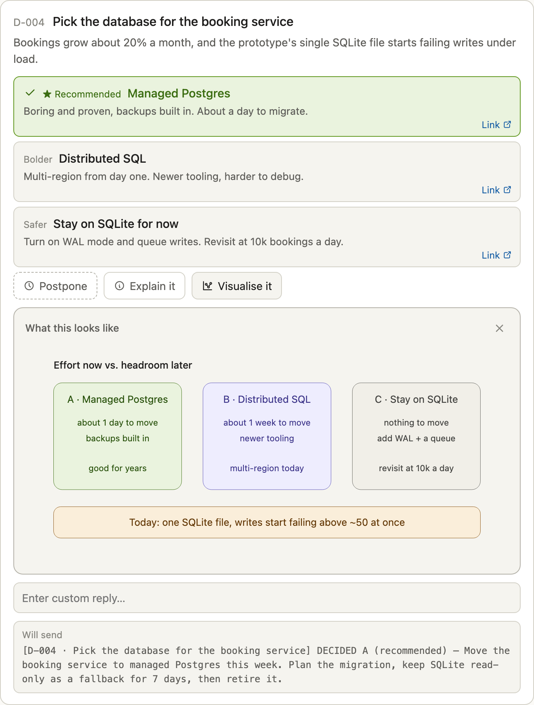
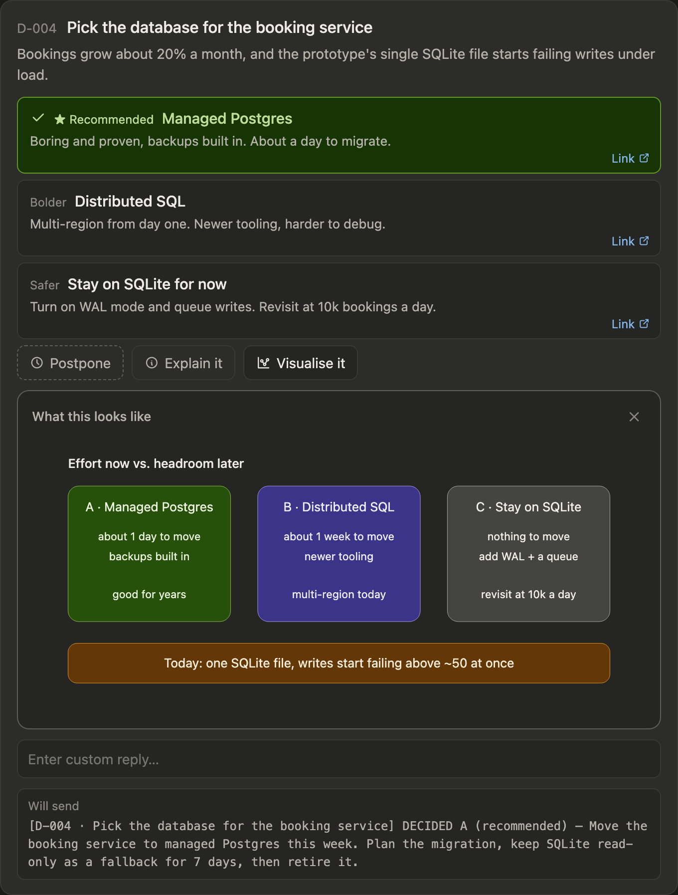

# Decision Board

**Ask for decisions the way people actually make them: three routes, one honest recommendation, one Send.**

When an AI assistant needs you to decide something, it usually writes a wall of text and ends with "Which would you prefer?". Decision Board replaces that with an interactive card for each decision, rendered right in the chat. You tap an answer, see exactly what will be sent, and send every decision at once.

**[Try the live demo →](https://st4rkis.github.io/claude-decision-board/demo/)**

<p align="center">
  
  
</p>

## What's on a card

- **Three routes, always in the same order** — **★ Recommended**, **Bolder**, **Safer**. The recommendation gets a green outline *only* when the assistant is genuinely confident; otherwise the card says "no strong recommendation". A star on a coin-flip teaches you to ignore the star.
- **A Link on every route** to the real file, doc or ticket it touches.
- **Postpone** — a real answer: "ask me again next round".
- **Explain it** — a short plain-words summary, ending in one bold *In short* line.
- **Visualise it** — a picture of the problem, the end state, or where each route leads.
- **Custom reply** — for when none of the three is right.
- **A live preview** of the exact instruction that will be sent. Tap another route and it updates.

One **Send** at the bottom sends every answered card as a single message. Change your mind afterwards and Send again: only the changed cards go, each marked as replacing your earlier answer. A **Tracker** tab lists every decision ever made, with its status.

## Quick start

### 1. Teach it to Claude (30 seconds)

Open [`PROMPT.md`](PROMPT.md), copy everything below its line, and paste it into a Claude chat. Claude saves the standard to its memory and uses a Decision Board from then on, whenever it needs a decision from you.

If your Claude can read web pages, this one line is enough:

```
Read https://github.com/st4rkis/claude-decision-board/blob/main/PROMPT.md and follow the instructions below its line. Save the standard to your memory, then confirm in one line.
```

### 2. Try it in a browser

Open the [live demo](https://st4rkis.github.io/claude-decision-board/demo/), or download this repo and open `demo/index.html`. Everything works the same, except that **Send** shows the message and copies it to your clipboard instead of posting it to a chat.

### 3. Render your own board

```bash
python3 tools/fill.py examples/cards.json --ledger examples/ledger.json > board.html
```

That produces the widget fragment a Claude client renders inline. Add `--standalone` for a complete page that runs in any browser. Python 3 standard library only — nothing to install.

The example prints one warning on purpose: `D-003` is postponed in the ledger but has no card this round. That's the safety net that stops a postponed decision from being quietly forgotten.

## What gets sent

Every line is a complete instruction the assistant can act on without asking again:

```
Decisions from the board:
[D-004 · Pick the database for the booking service] DECIDED A (recommended) — Move the booking service to managed Postgres this week. …
[D-005 · How to launch v2] DECIDED B (bolder) — Launch v2 to everyone on Monday. …
[D-006 · Remove the legacy CSV export] POSTPONED — not ready. Keep it open and ask me again next round.
```

The `[D-nnn · title]` prefix is how the assistant recognises your decision. It acts on it, then records it in the ledger.

## What's in this repo

| Path | What it is |
|---|---|
| [`PROMPT.md`](PROMPT.md) | The install prompt. Paste it into Claude. |
| [`board/board-template.html`](board/board-template.html) | The widget: one self-contained HTML fragment. |
| [`tools/fill.py`](tools/fill.py) | Fills the template from your cards and ledger. |
| [`examples/`](examples) | A complete example: three cards with pictures, and a ledger. |
| [`demo/index.html`](demo/index.html) | The example as a standalone page. |
| [`docs/SPEC.md`](docs/SPEC.md) | The full standard: every rule, and why. |

## The card format

```json
{
  "id": "D-004",
  "t": "Pick the database for the booking service",
  "conf": "high",
  "ctx": "One line: why this needs deciding now.",
  "explain": "Two or three short paragraphs.\n\nIn short: one line.",
  "viz": "<svg width=\"100%\" viewBox=\"0 0 680 300\" role=\"img\">…</svg>",
  "opts": [
    {"k": "A", "tag": "Recommended", "label": "Managed Postgres", "note": "One line on the consequence.",
     "p": "The instruction sent if this route is chosen.", "link": {"url": "https://…", "label": "What the link is"}},
    {"k": "B", "tag": "Bolder", "…": "…"},
    {"k": "C", "tag": "Safer", "…": "…"}
  ]
}
```

`conf: "high"` puts the green outline on route A. Anything else shows "no strong recommendation". See [`docs/SPEC.md`](docs/SPEC.md) for the ledger format and the rules for pictures.

## Where it runs

- **Inside Claude**, in clients that can render interactive visuals inline. Send posts straight to the chat.
- **In any browser**, through the standalone page.
- **Anywhere else** — a terminal session, a headless agent — the install prompt tells Claude to fall back to a multiple-choice question with the same three routes, Postpone, and the same reply format.

## Share it

MIT licensed. Use it, fork it, change the colours, put it in your own tools. If you improve it, a pull request is welcome.

---

A community project, not affiliated with Anthropic. Created by [@st4rkis](https://github.com/st4rkis).
